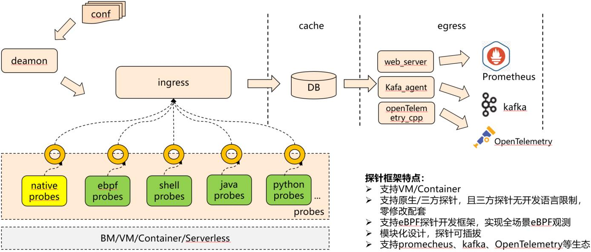
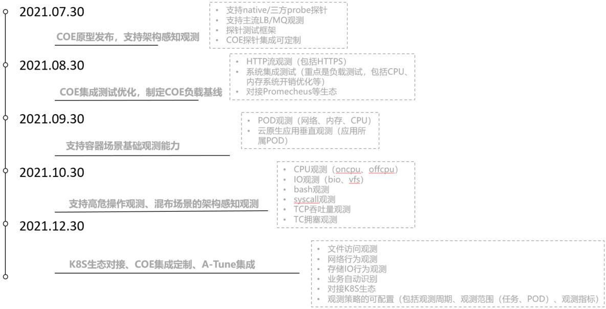

# gala-gopher

## 介绍
gala-gopher是基于eBPF的低负载探针框架，致力于提供裸机/虚机/容器场景下的云原生观测引擎（cloud observation engine），帮助业务快速创新；

## 快速开始

### 基于源码编译、安装、运行

- 安装依赖

  安装开发库

  ```bash
  yum install cmake -y
  yum install gcc-c++ -y
  yum install libconfig-devel -y
  yum install librdkafka-devel -y
  yum install libmicrohttpd-devel -y
  ```

- 构建

  ```bash
  sh build.sh
  ```

- 安装

  ```bash
  sh install.sh
  ```

- 运行

  ```bash
  gala-gopher
  ```

### 基于rpm包安装运行

- rpm安装

  ```bash
  yum localinstall gala-gopher.rpm
  ```

- 运行

  ```bash
  gala-gopher
  ```

## 总体介绍

gala-gopher是基于eBPF的低负载探针框架，并集成了常用的native探针、知名中间件探针；gala-gopher有良好的扩展性，能方便的集成各种类型的探针程序，发挥社区的力量丰富探针框架的能力；gala-gopher中的几个主要部件：

- gala-gopher框架

  gala-gopher的基础框架，负责配置文件解析、native探针/三方探针的管理、探针数据收集管理、探针数据上报对接、集成测试等；

- native探针

  原生探针，主要是基于linux的proc文件系统收集的系统观测指标；

- 三方探针

  支持shell/java/python/c等不同语言的第三方探针程序，仅需满足轻量的数据上报格式即可集成到gala-gopher框架中；方便满足各种应用场景下的观测诉求；目前已实现知名中间件程序的探针观测及指标上报，如：lvs、nginx、haproxy、dnsmasq、dnsbind、kafka、rabbitmq等；

- 部署配置文件

  gala-gopher启动配置文件，可自定义具体使能的探针、指定数据上报的对接服务信息（kafka/promecheus等）

后续会详细针对各部件/关键流程展开介绍；

### 运行架构



### 探针开发构建流程


## 详细介绍

### 配置文件介绍

[配置文件介绍](doc/conf_introduction.md)

### 如何开发一个探针

[如何开发一个探针](doc/how_to_add_probe.md)

### eBPF探针开发指南

[eBPF探针开发指南](src/probes/extends/ebpf.probe/README.md)

### 如何实现探针编译裁剪

[如何实现探针编译裁剪](doc/how_to_tail_probe.md)

### 测试框架介绍

[测试框架介绍](test/README.md)

## 负载测试

## gala-gopher路标




