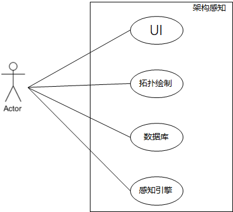
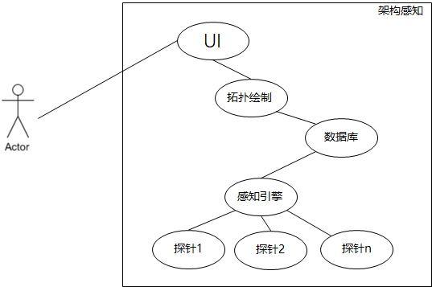
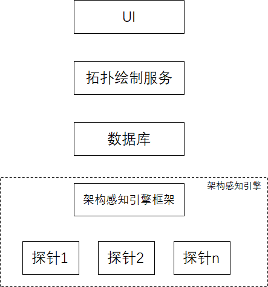
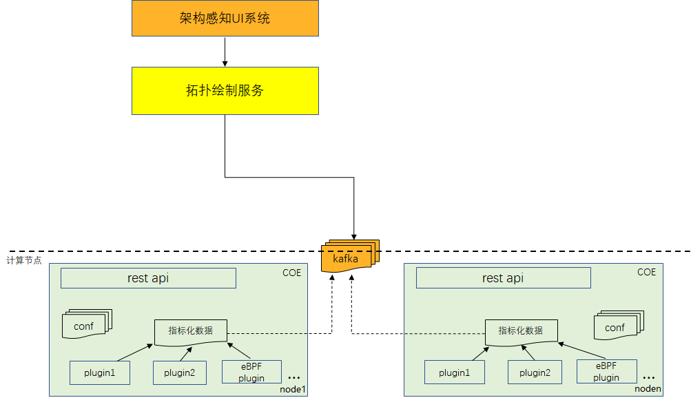
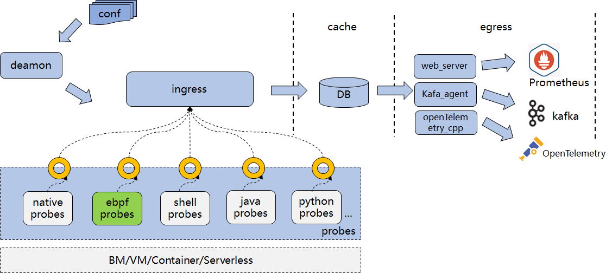
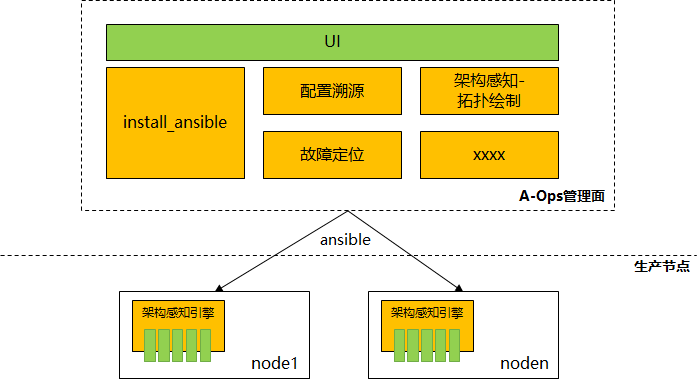
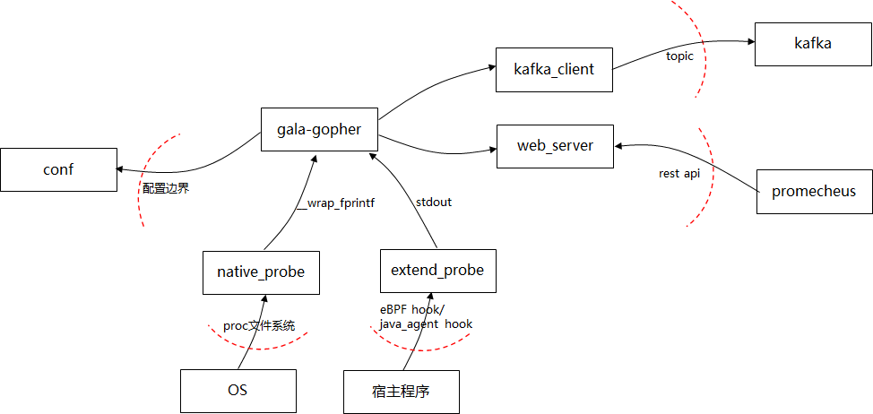
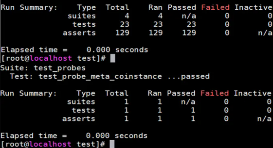
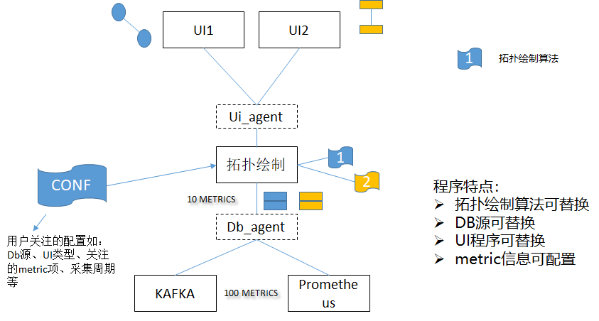

# 1、需求描述
随着软件技术的发展和应用场景的丰富，软件系统从开发、部署、运行等各个维度都发生了很大的变化：

- DevOps带来了更加敏捷的软件开发，软件版本更新节奏越来越快，要求观测能力具备更高的效率；
- 软件系统从传统单体架构演变成分布式、层次化软件栈，要求系统有能力观测到这些复杂的软件依赖关系，另一方面也要求观测技术能够与应用实现本身解耦，避免出现相互约束；
- 部署形式从单机部署发展到虚机/容器化部署，软件的基础设施也都搬到了云上；要求系统观测要有弹性能力，且具备生态能力对接到不同的基础设施环境中；

架构感知是从OS视角自动感知集群系统架构，直观的查看集群节点与节点间的通信依赖关系及拓扑指标信息，帮助业务快速创新；

## 1.1、受益人
|角色|角色描述|
|:--|:-------|
| 社区开发者 | 对项目感兴趣的并想参与到项目中，共同完善架构感知能力 |
| 系统运维人员 | 系统运维人员，需要对整个集群系统做运维、升级、故障定位等工作 |

## 1.3、依赖组件
|组件|组件描述|可获得性|
|:--|:-------|:------|
| neo4j browser | 图数据库浏览器 | Y |
| kafka | 中间件，用于存储架构感知各节点观测的上报数据信息 | Y |

## 1.3、License

Mulan PSL v2 

# 2、设计概述

## 2.1、分析思路

架构感知是从OS视角自动感知集群系统架构，直观的查看集群节点与节点间的通信依赖关系及拓扑指标信息；

总体看整个系统大致分为几部分：

1. node上的感知引擎

   每个node节点上需要部署一个感知引擎，从OS视角监控/观察系统的运行状态（如tcp链路、链路指标等）；感知引擎是整个架构感知的核心部件，是数据采集源头；结合DFX要求，感知引擎的设计应该满足几点：

   - 扩展性

     运行态观测的数据各种各样，不同解决方案场景下可能也不同，感知引擎需要能够灵活的扩展观测点/观测项；

   - 性能

     感知引擎对宿主机/宿主程序的负载影响应该尽量小；

   - 可测试性

     提供自测试/集成测试能力；

   - 可靠性

     感知引擎的各观测插件之间尽量解耦，控制异常影响范围；感知引擎异常不会扩散到宿主机/宿主程序；不会降低宿主机程序的可靠性；

   - 可服务性

     感知引擎的安装部署是否方便，三方探针集成是否方便；

2. 数据库程序

   对于各个节点观测的数据，需要统一汇总到数据库存储，参考业界观测系统，需要支持kafka、promecheus、telemetry；数据库作为被依赖程序由解决方案提供；

   数据库服务

3. 拓扑绘制服务

   根据各个节点上报的观测数据，整合分析得到整个集群的拓扑关系及拓扑指标信息；是一个独立的服务部件；绘制拓扑是该服务的基础功能，真正商用场景上，不同解决方案基于感知上报的数据可做的数据加工处理会多种多样，本次设计为实现一个端到端的架构感知完整系统，仅设计基本的拓扑绘制，以满足最小可用架构感知系统；商用场景需要结合具体解决方案设计数据加工程序；

   拓扑绘制服务从可扩展性的角度，设计时需考虑如下：

   - DB源可替换
   - 拓扑绘制算法可替换
   - UI层可替换
   - 可配置观测范围

4. 拓扑UI

   基于拓扑绘制服务加工的拓扑信息完成UI绘图，对比当前流行的图形绘制程序，选择neo4j browser作为UI程序；

综合设计目标，采用基于eBPF技术，实现非侵入、低负载的架构感知服务；

eBPF相关的详细介绍可参考：https://ebpf.io/zh-cn/

## 2.2、设计原则

除了基本的DFX设计准则外，在程序设计时考虑以下几个方面：

1. 部件内模块化设计

   特别是感知引擎，需要考虑对接数据库的可替换性，探针程序的灵活扩展；程序设计时按模块功能划分不同的子模块，子模块间尽量松耦合；

2. 部件间标准接口，考虑生态对接

3. 非侵入观测手段

   感知引擎以非侵入方式观察宿主程序；

# 3、需求分析
## 3.1、USE-CASE视图
### 3.1.1 架构感知部署



用户分别部署UI、拓扑绘制服务、数据库、感知引擎程序；

### 3.1.2 架构感知运行观测



架构感知运行观测逻辑：各探针程序上报探针数据，有感知引擎上报给数据库系统，拓扑绘制程序从数据库中收集各节点上报的观测数据，整理分析集群的拓扑关系，交给UI呈现给用户；

## 3.2、逻辑视图

架构感知总体逻辑视图：



其中UI/数据库使用开源程序，不展开分析；

### 3.2.1 架构感知引擎


架构感知引擎主要分为引擎框架和探针程序两部分；探针框架包括：

- conf

  定义探针引擎的用户配置，如：数据上报对接的数据库信息，探针启用开关、上报周期等；

- deamon

  探针引擎主程序，负责配置解析、探针管理、数据库对接以及整个数据上报流程的管理协同；

- ingress

  数据上报入方向处理模块，对接不同probes上报的数据；

- egress

  数据上报出方向处理模块，对接不同数据库上报；

- probes

  探针管理模块，负责native_probe（proc文件系统下linux自带的系统指标）和extends_probes（三方探针）的调度、监控等；

- test

  测试框架；

### 3.2.2 拓扑绘制


拓扑绘制程序分为：绘制层、db适配层、ui适配层；

- conf

  配置文件，定义如：Db源、UI类型、关注的metric项、采集周期等；

- db_agent

  数据源适配层，用于适配各种拓扑数据源，并转换成内部数据结构；

- 拓扑绘制

  根据拓扑数据源数据，做数据处理，输出作为UI层的输入；其中数据处理（拓扑绘制）算法支持可替换；

- ui_agent

  UI适配层，将拓扑数据处理结果对接到不同UI系统，满足不同场景下的数据呈现要求；


## 3.3、开发视图
### 3.3.1 架构感知引擎

```shell
gala-gopher
    ├─config			// 默认配置文件
    ├─doc				// 文档目录
    ├─src				// 源码目录
    │  ├─daemon
    │  ├─egress
    │  │  └─kafka
    │  │  └─web_server
    │  ├─ingress
    │  ├─lib			// 基础库
    │  │  ├─config
    │  │  ├─fifo
    │  │  ├─imdb
    │  │  ├─meta
    │  │  └─probe
    │  ├─probes
    │  │  ├─native
    │  │  └─extends
    │  │     ├─ebpf.probe
    │  │     ├─python.probe
    │  │     └─sh.probe
    │  └─resource
    └─test
       ├─test_modules
       └─test_probes
```

总体代码结构与逻辑图类似，lib基础库中封装了一些基础功能/api文件；

### 3.3.2 拓扑绘制

```shell
spider
  ├─config
  ├─doc
  ├─ui_agent
  │  └─neo4j_browser
  ├─data_process
  │  └─topo_draw
  ├─daemon
  └─db_agent
     └─kafka
```

## 3.4、部署视图



- 架构感知引擎部署在各个计算节点上；以rpm/operator形式发布；
- 拓扑绘制服务单独部署；以rpm/operator形式发布；
- 数据库（kaka）按解决方案要求部署（单节点/集群）；
- UI单独部署；

### 3.4.1 架构感知引擎



每个生产节点上部署架构感知引擎服务；模块间配合关系如上；

### 3.4.2 拓扑绘制

管理节点上部署拓扑绘制服务；

### 3.4.3 典型场景

以CDN简化场景为例，在CDN组网环境中部署架构感知服务；


其中：

1. 集群节点、客户端部署架构感知引擎；
2. 部署kafka、拓扑绘制服务和neo4j browser，完成数据库存储和拓扑绘制；

### 3.4.4 A-Ops集成部署



A-Ops通过install-ansible集成组件；架构感知/配置溯源作为组件集成到A-Ops中；

A-Ops新增组件集成步骤如下：

- 准备好组件发布件

  架构感知服务对外发布件包括：

  - gala-gopher.rpm

    需要在每个node节点上部署

  - gala-spider.rpm

    在管理节点上部署

- 增加组件到task.yaml

  install-ansible是按照task.yaml编排组件的；

  ```yaml
  ---
  step_list: # 步骤列表
   kafka: # 第一步安装kafka，可以使用默认模板
    enable: # false 置为false则跳过安装步骤，true执行安装步骤
    continue: # false 置为false则安装失败时终止任务，true执行安装失败时继续下一个组件安装
    ...
   gala-gopher: # 安装gala-gopher自定义组件
    enable: true
    continue: true
  ```

- 自定义组件模板

  - 组件playbook
  - config.yaml
  - install.yaml
  - start.yaml

详细请参考：`a-ops_部署_README.MD`。

### 3.4.5 按照目录分析

gala-gopher.rpm安装目录：

```sh
[root@openeuler-development-1-ir8cz gala-gopher]# ll /usr/bin/gala-gopher
-rwxr-xr-x. 1 root root 188K Jun 29 10:51 /usr/bin/gala-gopher
[root@openeuler-development-1-ir8cz /opt]# tree
gala-gopher					    -- dr-xr-x---.
├── extend_probes				-- dr-xr-x---.
│   ├── nginx_probe				-- -r-xr-x---.
│   ├── rabbitmq_probe.sh
│   ├── redis_probe.py
│   ├── trace_dnsmasq
│   ├── trace_haproxy
│   └── trace_lvs
├── gala-gopher.conf			-- -rw-r-----.
└── meta					   -- drwxr-x---.
    ├── dnsmasq_link.meta		-- -rw-r-----.
    ├── example.meta
    ├── fileprobe.meta
    ├── haproxy_link.meta
    ├── killprobe.meta
    ├── ipvs_link.meta
    ├── nginx_link.meta
    ├── rabbitmq_probe.meta
    ├── redis_probe.meta
    ├── system_inode.meta
    ├── system_meminfo.meta
    ├── system_tcp.meta
    ├── system_vmstat.meta
    └── tcp_link.meta
```

## 3.5、DFX分析

### 3.5.1、规格

- gala-gopher主程序：

  | 规格名称  | 规格指标  |
  | --------- | --------- |
  | 内存占用  | < 50M     |
  | CPU使用率 | 单核 < 1% |

  

- gala-gopher各探针

  探针的规格取决于观测对象，如nginx在10w+负载时，nginx探针的CPU开销可能比较大（超过10%）；但对于有些周期运行的探针，cpu开销则比较小；

  简单起见，不针对探针单独设定资源上限；总体控制负载；

- 总体负载控制

  为防止探针程序总资源开销过大，通过cgroup控制探针的cpu上限；考虑将gala-gopher主程序及拉起的探针程序添加到一个监控cgroup组中；设置该cgroup组的cpu使用上限；目标探针总负载：CPU峰值使用率 单核 < 5% ~ 10%。

- 数据库压力规格

  集群中每个node上都会启用架构感知引擎，周期上报观测的指标数据到集群数据库；

  周期时间内，数据库中收到的观测指标数与集群node节点数、引擎上各探针上报指标数有关；

  当前每个指标项在一轮上报周期内（默认5s），最多上报64条指标信息，每个指标最多有64个指标项，每个指标值最大32个字节；

### 3.5.2、系统可靠性设计

运维相关服务，无特殊要求；

### 3.5.3、安全性设计

架构感知引擎安全威胁分析：



- 涉及eBPF探针，架构感知引擎执行需要root用户权限；
- conf中涉及配置探针命令，gala-gopher根据二进制程序名称和后缀查找执行；对于二进制程序增加防篡改校验；（rpm -V A-Ops）

### 3.5.4、兼容性设计

不涉及；

### 3.5.5、可服务性设计

- 运维相关程序，如果探针引擎运行过程中异常了，需要重新执行启动命令；

- 如果探针运行过程中异常退出，探针引擎可感知探针状态重新拉起探针，最多重试3次；

- 拓扑绘制服务故障后需要重新执行启动命令；


### 3.5.6、可测试性设计

架构感知引擎中引入了CUint测试框架，并实现了引擎程序、native/extends探针的启动运行等基本功能测试例防护；效果如下：



- 如何增加一个测试例

  [增加一个测试例](../test/README.md)

## 3.6、特性清单
### 3.6.1 架构感知引擎

架构感知引擎主要特性介绍请[进入](../README.md)；

### 3.6.2 拓扑绘制

- 拓扑绘制服务总体设计



- 拓扑绘制算法的基本思路

  数据源的基础数据包括：

  - 位置信息（hostName、procName、pid）
  - 链路信息（四元组[源ip, 目的ip, 目的port, proto]、role、linkCount）
  - 链路指标信息（rx/tx/lost/rtt等）
  - 链路关联信息（中间件串联链路信息）；

  绘图思路：

  1. 根据位置信息确定点；
  2. 根据四元组确定点上的线；
  3. 根据role确定线方向；
  4. 指标信息标记在线上；
  5. 根据中间件的串联信息，将经过中间件的入方向线和出方向线分组，串联经过中间件的整个业务流；

- 拓扑绘图示例

  拓扑绘制服务从数据库抓取架构感知引擎上报的指标数据整理绘制拓扑；指标数据解析依据各metric的meta文件定义；

  以kafka数据库为例（其他数据库格式可能不同），上报的topic `gala_gopher `数据示例如下：

  ```
  {"timestamp": -143226184, "hostname": "cmt2vm7", "table_name": "tcp_link", "pid": "107977", "process_name": "udsvr", "role": "0", "client_ip": "192.168.122.43", "server_ip": "192.168.122.27", "server_port": "6121", "protocol": "2", "link_count": "5", "rx_bytes": "0", "tx_bytes": "11", "packets_in": "160", "packets_out": "548443902", "retran_packets": "0", "lost_packets": "326400", "rtt": "0"}
  ```

  数据格式为：

  ```
  |timestamp|hostname|table_name|table_itemName1|table_itemValue1|table_itemName2|table_itemValue2|...
  ```

  topic中的字段说明：

  - timestamp：数据上报时间戳
  - hostname：主机名，位置信息；位置信息不同解决方案场景可能不一样，如容器场景下会带上pod/node信息等；
  - table_name：具体上报的指标名称；
  - table_itemValue|table_itemName：指标项名称|指标项值；

  对于拓扑绘制中各个指标信息的使用，做如下解释。

  - tcp_link

    tcp链路指标，指标项描述：

    | 指标项         | 含义                | 备注 |
    | -------------- | ------------------- | ---- |
    | pid            | 进程pid             |      |
    | process_name   | 进程名              |      |
    | role           | 角色，client/server |      |
    | client_ip      | 客户端ip            | KEY  |
    | server_ip      | 服务端ip            | KEY  |
    | server_port    | 服务端口            | KEY  |
    | protocol       | 协议类型（tcp）     | KEY  |
    | link_count     | 链路数              |      |
    | rx_bytes       | 收包字节数          |      |
    | tx_bytes       | 发包字节数          |      |
    | packets_in     | 收包个数            |      |
    | packets_out    | 发包个数            |      |
    | retran_packets | 重传包数            |      |
    | lost_packets   | 丢包数              |      |
    | rtt            | 平均时延            |      |

    - 拓扑绘制思路

      1. 查找拓扑的起点和终点
         - 遍历所有tcp指标，以{key}寻找周期上报数据中所有1条的数据；
         - 如果role是1（client），则该记录为起点；role是0（server），为终点；
      2. 从起点开始依次查找对端
         - 以{key}寻找role为server的对端节点；
      3. 从节点开始找以本节点为client角色的记录，对应的对端记录
      4. 当找到的节点为终点，则停止绘制；

      以上，可以将基本的拓扑绘制出来，并可标记数据流方向；

  - nginx_link

    nginx观测指标，指标项：

    | 指标项       | 含义                      | 备注 |
    | ------------ | ------------------------- | ---- |
    | client_ip    | 客户端ip                  |      |
    | virtual_ip   | 服务ip（nginx对外服务ip） |      |
    | server_ip    | backend ip                |      |
    | virtual_port | virtual port              |      |
    | server_port  | backend port              |      |
    | is_l7        | 是否七层LB转发            |      |
    | link_count   | 链路数                    |      |

    - 拓扑绘制思路

      对于nginx上报的数据，将{client_ip, virtual_ip}、{virtual_ip, server_ip, server_port}这两条tcp链路标记为一组，并将该组链路的上下游链路标记成同一颜色；

  - ipvs_link

    lvs观测指标，指标项：

    | 指标项       | 含义         | 备注 |
    | ------------ | ------------ | ---- |
    | process_name | 进程名       |      |
    | client_ip    | 客户端ip     |      |
    | virtual_ip   | vip          |      |
    | local_ip     | local ip     |      |
    | server_ip    | 后端服务ip   |      |
    | server_port  | 后端服务port |      |
    | virtual_port | vport        |      |
    | protocol     | 协议类型     |      |
    | family       | 地址族       |      |
    | link_count   | 链路数       |      |

    - 拓扑绘制思路

      与nginx类似，将{client_ip, virtual_ip, virtual_port}、{local_ip, server_ip, server_port}这两条tcp链路标记为一组，并将该组链路的上下游链路标记成同一颜色；

  采集数据中的其他LB（haproxy等）也是类似的思路；

### 3.6.3 需求列表

| SR                                                           | AR                                                           | 详细描述                                                     | 落地版本              |
| ------------------------------------------------------------ | ------------------------------------------------------------ | ------------------------------------------------------------ | --------------------- |
| gala-gopher基础探针框架搭建，实现基本的探针采集、上报功能    | gala-gopher实现数据上报入方向处理模块                        | gala-gopher实现数据上报入方向处理模块，接收各探针上报的观测数据 | 21.09                 |
|                                                              | gala-gopher实现上报数据的处理模块                            | gala-gopher实现上报数据的处理模块，将探针数据转换成内部数据结构存储； | 21.09                 |
|                                                              | gala-gopher实现数据上报出方向处理模块                        | gala-gopher实现数据上报出方向处理模块，将内部存储的观测数据对接外部数据库上报； | 21.09                 |
| gala-gopher支持对接kafka                                     | gala-gopher支持指定kafka配置                                 | gala-gopher支持指定kafka配置，包括kafka的ip地址信息等；      | 21.09                 |
|                                                              | gala-gopher集成kafka   client，对接kafka                     | gala-gopher集成kafka   client，对接kafka                     | 21.09                 |
|                                                              | gala-gopher收集各探针观测的数据，并上报kafka                 | gala-gopher收集各探针观测的数据，并上报kafka                 | 21.09                 |
| gala-gopher支持对接Prometheus                                | gala-gopher支持指定Prometheus配置                            | gala-gopher支持指定Prometheus配置，包括Prometheus的ip地址信息等； | 不在本次交付/测试范围 |
|                                                              | gala-gopher提供http查询接口，支持Prometheus查询探针上报数据  | gala-gopher提供http查询接口，支持Prometheus查询探针上报数据  | 不在本次交付/测试范围 |
|                                                              | gala-gopher收集各探针观测的数据，并缓存在Prometheus数据上报通道中 | gala-gopher收集各探针观测的数据，并缓存在Prometheus数据上报通道中 | 不在本次交付/测试范围 |
| gala-gopher支持探针编译裁剪                                  | gala-gopher支持tail.conf裁剪文件定义入口                     | gala-gopher支持tail.conf裁剪文件定义入口，tail.conf中指定需要裁剪的探针信息； | 21.09                 |
|                                                              | gala-gopher在build.sh编译过程中，解析tail.conf并将其定义的各个采集项申明成环境量 | gala-gopher支持探针编译裁剪，以满足不同解决方案场景下构建最小可用探针；具体包括：native/三方探针的编译可裁剪； | 21.09                 |
|                                                              | native探针编译时支持根据tail.conf的裁剪项按需编译探针        | native探针编译时支持根据tail.conf的裁剪项按需编译探针        | 21.09                 |
|                                                              | 三方探针编译时支持根据tail.conf的裁剪项按需编译探针          | 三方探针编译时支持根据tail.conf的裁剪项按需编译探针          | 21.09                 |
| gala-gopher支持配置启动探针列表                              | gala-gopher支持配置启动探针列表                              | gala-gopher支持配置启动探针列表，conf文件中配置需要启动的探针程序名； | 21.09                 |
|                                                              | gala-gopher支持根据指定的探针程序名称启动探针                | gala-gopher支持根据指定的探针程序名称启动探针，根据程序名称   + 后缀查找执行探针； | 不在本次交付/测试范围 |
|                                                              | gala-gopher支持探针程序的防篡改校验                          | gala-gopher支持探针程序的防篡改校验，基于rpm   -V A-Ops校验探针程序是否被篡改； | 不在本次交付/测试范围 |
| gala-gopher支持自动识别节点观测类型，启动相应探针            | gala-gopher支持指定探针auto启动模式                          | gala-gopher支持指定探针auto启动模式                          | 21.09                 |
|                                                              | gala-gopher支持自定义auto探针的启动检测逻辑                  | gala-gopher支持自定义auto探针的启动检测逻辑                  | 21.09                 |
|                                                              | gala-gopher根据auto探针的启动检测逻辑，决定是否启用探针      | gala-gopher根据auto探针的启动检测逻辑，决定是否启用探针      | 21.09                 |
| 支持探针自定义观测指标                                       | 支持探针自定义观测指标                                       | 支持探针自定义观测指标，包括：指标项名称、指标值类型、上报周期、探针开关类型等； | 21.09                 |
| 支持OS基础指标信息采集                                       | 实现OS基础指标信息采集                                       | 实现OS基础指标信息采集，包括：tcp、vmstat、inode、meminfo    | 不在本次交付/测试范围 |
|                                                              | 定义metric   meta文件                                        | 定义metric   meta文件，包括：tcp、vmstat、inode、meminfo中的各项指标信息； | 不在本次交付/测试范围 |
| 支持tcp链路及指标观测                                        | 实现tcp链路及指标观测采集                                    | 实现tcp链路及指标观测采集，基于ebpf观测connect、accept、close等内核函数，记录指标信息； | 21.09                 |
|                                                              | 定义metric   meta文件                                        | 定义metric   meta文件，包括   pid、process_name、role、client_ip、server_ip、server_port、protocol、link_count、rx_bytes、tx_bytes、packets_in、packets_out、retran_packets、lost_packets、rtt； | 21.09                 |
| 支持lvs链路观测                                              | 实现lvs链路观测采集                                          | 实现lvs链路观测采集，基于ebpf开发lvs探针程序，将前后端链路串联起来； | 21.09                 |
|                                                              | 定义metric   meta文件                                        | 定义metric   meta文件，包括   process_name、client_ip、virtual_ip、local_ip、server_ip、server_port、virtual_port、protocol、family、link_count | 21.09                 |
| 支持haproxy链路观测                                          | 实现haproxy链路观测采集                                      | 实现haproxy链路观测采集，基于ebpf开发haproxy探针程序，将前后端链路串联起来； | 21.09                 |
|                                                              | 定义metric   meta文件                                        | 定义metric   meta文件，包括   process_name、client_ip、virtual_ip、local_ip、server_ip、server_port、virtual_port、protocol、family、link_count | 21.09                 |
| 支持nginx链路观测                                            | 实现nginx链路观测采集                                        | 实现nginx链路观测采集，基于ebpf开发nginx探针程序，将前后端链路串联起来； | 21.09                 |
|                                                              | 定义metric   meta文件                                        | 定义metric   meta文件，包括 client_ip、virtual_ip、server_ip、server_port、is_l7、link_count； | 21.09                 |
| 支持rabbitmq链路观测                                         | 实现rabbitmq链路观测采集                                     | 实现rabbitmq链路观测采集，记录rabbitmq的生产者、消费者信息； | 21.09                 |
|                                                              | 定义metric   meta文件                                        | 定义metric   meta文件，包括 rabbitmq_server、productors、consumers | 21.09                 |
| 支持kafka链路观测                                            | 实现kafka链路观测采集                                        | 实现kafka链路观测采集，基于java-agent开发kafka探针程序，基于topic记录生产者、消费者信息； | 21.09                 |
|                                                              | 定义metric   meta文件                                        | 定义metric   meta文件，包括 process_name、productors、consumers、topic、rec_count | 21.09                 |
| 支持dnsmasq链路观测                                          | 实现dnsmasq链路观测采集                                      | 实现dnsmasq链路观测采集，基于ebpf开发kafka探针程序，记录dns访问信息； | 21.09                 |
|                                                              | 定义metric   meta文件                                        | 定义metric   meta文件，包括 client_ip、virtual_ip、family、link_count、pid、process_comm | 21.09                 |
| gala-gopher支持自动化测试                                    | gala-gopher实现基于Cunit的测试框架                           | gala-gopher测试框架搭建，实现基于Cunit的集成测试框架，帮助探针程序快速验证； | 21.09                 |
|                                                              | gala-gopher支持探针基本测试例防护                            | gala-gopher支持探针基本测试例防护；包括：探针框架各子模块关键函数测试例开发，探针启动、metric指标校验基本测试例开发； | 21.09                 |
|                                                              | gala-gopher支持一键式测试脚本执行                            | gala-gopher支持一键式测试脚本执行，封装良好的测试调度脚本；  | 21.09                 |
| gala-gopher支持rpm包发布                                     | 实现基于cmake的gala-gopher编译脚本                           | 实现基于cmake的gala-gopher编译脚本                           | 21.09                 |
|                                                              | 实现gala-gopher安装脚本                                      | 实现gala-gopher安装脚本                                      | 21.09                 |
|                                                              | 定义gala-gopher的spec文件                                    | 定义gala-gopher的spec描述文件                                | 21.09                 |
| gala-gopher支持native探针集成                                | gala-gopher支持native探针集成到探针框架编译                  | gala-gopher支持native探针集成到探针框架编译；编译脚本中通过native探针名替换探针程序main函数，将native探针程序编译链接到探针引擎中； | 不在本次交付/测试范围 |
|                                                              | gala-gopher支持自动扫描native探针程序编译功能                | gala-gopher支持自动扫描native探针程序编译功能；遍历native探针目录 | 不在本次交付/测试范围 |
|                                                              | gala-gopher支持自动扫描native探针程序打包安装                | gala-gopher支持自动扫描native探针程序打包安装；              | 不在本次交付/测试范围 |
| gala-gopher支持探针状态监控                                  | gala-gopher支持探针状态监控                                  | gala-gopher支持探针状态监控，定期检查探针程序进程状态是否ok，若探针异常，尝试重新拉起探针，最多重试3次； | 不在本次交付/测试范围 |
| gala-gopher支持三方探针集成                                  | gala-gopher支持三方探针集成编译                              | gala-gopher支持三方探针集成编译，build.sh中扫描三方探针目录，执行目录下的build.sh脚本 | 21.09                 |
|                                                              | gala-gopher支持三方探针集成安装                              | gala-gopher支持三方探针集成安装，install.sh中扫描三方探针目录，执行目录下的install.sh脚本 | 21.09                 |
| 架构感知服务支持集成到A-Ops系统                              | 定义架构感知服务的引擎组件模板                               | 定义架构感知引擎的组件模板，包括：      1、添加到task.yaml编排任务；      2、定义组件的main.yaml，其中调用config.yaml/install.yaml/start.yaml；      3、定义templates模板，config.yaml中根据template模板的实际环境量信息生成config文件；      4、templates模板中定义需要安装的节点列表，将架构感知引擎安装到集群的生产环境节点上； | 21.09                 |
|                                                              | 定义架构感知服务的拓扑绘制组件模板                           | 定义架构感知引擎的组件模板，包括：      1、添加到task.yaml编排任务；      2、定义组件的main.yaml，其中调用config.yaml/install.yaml/start.yaml； | 21.09                 |
| 架构感知服务支持探针程序负载控制，降低对宿主系统的负载开销影响 | 支持配置探针引擎程序的cpu负载单核控制1%以内，内存50M以内     | 支持配置探针引擎程序的cpu负载单核控制1%以内，内存50M以内     | 不在本次交付/测试范围 |
|                                                              | 支持监控探针程序的cpu总负载在5%   ~ 10%以内                  | 支持监控探针程序的cpu总负载在5% ~ 10%以内；                  | 不在本次交付/测试范围 |
| 支持架构感知拓扑绘制                                         | 拓扑绘制服务集成kafka消费端                                  | 拓扑绘制服务集成kafka消费端，实现与kafka对接；               | 21.09                 |
|                                                              | 拓扑绘制服务支持从kafka消费各探针节点的观测数据              | 拓扑绘制服务支持从kafka消费各探针节点的观测数据；            | 21.09                 |
|                                                              | 基于kafka数据整理拓扑绘制的点、线、方向、指标信息；          | 基于kafka数据整理拓扑绘制的点、线、方向、指标信息；          | 21.09                 |
|                                                              | 拓扑绘制服务支持对接neo4j   browser                          | 拓扑绘制服务支持对接neo4j   browser，将拓扑数据存储到neo4j的graph数据库中； | 21.09                 |
|                                                              | 拓扑绘制服务支持免密对接neo4j   browser                      | 拓扑绘制服务支持免密对接neo4j   browser，无需在配置文件中显示配置UI登陆密码； | 不在本次交付/测试范围 |

## 3.7、接口清单

### 3.7.1、外部接口清单

**架构感知引擎：**

对外接口主要涉及：

- gala-gopher配置文件

  配置文件具体描述请[进入](conf_introduction.md)；

- 探针开发

  探针开发说明请[进入](how_to_add_probe.md)；包括：探针meta文件定义、探针对接规范；

**拓扑绘制：**

- 配置文件

  自定义拓扑绘制服务的外部配置参数如下：

  ```shell
  [global]
  data_source = "kafka"				// 配置数据源 如 kafka | promecheus
  ui_source = "neo4j"					// 配置对接的UI 如 neo4j
  
  [kafka]							   // 数据源kafka的参数
  topic = gala_gopher					// 关注的topic名称
  broker = ["10.137.17.123:9092"]		 // kafka地址信息
  
  [promecheus]					   // 数据源promecheus的参数
  broker =
  
  [table_info]					   // 配置关注的指标数据
  base_table_name = ["tcp_link", "ipvs_link"]
  other_table_name = ["nginx_link" , "ipvs_link" , "haproxy_link" , "dnsmasq_link"]
  
  [option]						
  exclude_addr = "192.168.150"		// 指定排除哪些地址
  
  [neo4j]							  // UI为neo4j
  address = http://localhost:7474		// neo4j地址
  username = neo4j				   // 用户名
  ```

- 拓扑绘制服务南向

  南向从数据库（kafka/promecheus等数据库服务订阅集群观测数据），主要是通过数据库agent实现对接；

- 拓扑绘制服务北向

  北向对接UI程序（neo4j browser等），也是通过ui_agent实现对接；

### 3.7.2、内部模块间接口清单

|接口名称|接口描述|入参|输出|异常|
|:-------|:------|:---|:---|:---|
||||||
||||||

# 4、修改日志
|版本|发布说明|
|:--|:-------|
|||
|||


# 5、参考目录

