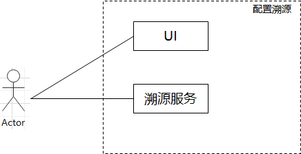
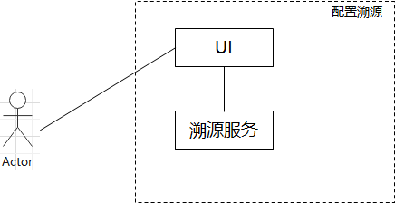
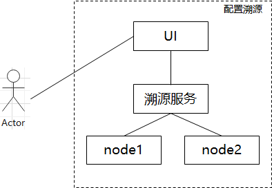
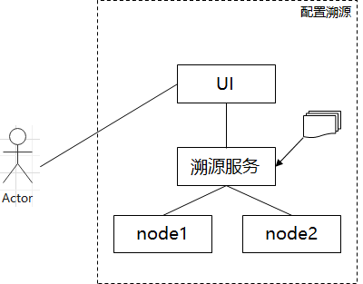
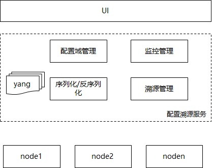
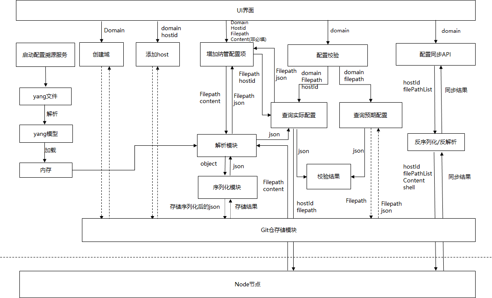
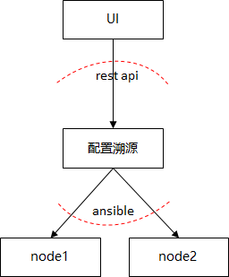

1、需求描述

根据OS故障率统计，大部分故障是由于应用在使用基础系统（包括OS）不当导致，其中配置错误、资源限制这两类故障原因占比>80% 。 

传统运维模式下，对基础软件的配置存在以下一些问题：

- 需要人手工配置，无法保证可信
- 管理员之间无法获取历史修改记录，无法溯源
- 由配置变更引起的故障无法快速、准确定位
- 集群操作不方便，工作量大（集群内可能还涉及不同类型OS），且无法保证正确性

期望能够有这样一个OS配置托管服务，能够实现对OS配置的集群式管理，屏蔽不同OS类型的配置差异，实现统一的、可溯源的、预期配置可管理的可信的OS配置运维入口；

## 1.1、受益人
|角色|角色描述|
|:--|:-------|
| 社区爱好者 | 对该项目感兴趣并且想参与到项目中，共同完善配置溯源的能力 |
| 系统运维人员 | 系统运维人员，需要对OS等基础软件做配置，需要定位OS配置相关的问题 |

## 1.3、依赖组件
|组件|组件描述|可获得性|
|:--|:-------|:------|
| git | 存储配置文件序列化后的内容 | Y 开源软件 |
| libyang | yang模型的语言库 | Y 开源软件 |
| python基础库 | python的基础库系列 | Y 开源软件 |

## 1.3、License

Mulan PSL v2 

# 2、设计概述

## 2.1、分析思路

配置溯源服务需要解决几个问题：

- 能够集群化管理OS配置；
- 屏蔽不同OS的配置文件差异，对上提供统一的操作接口；
- 对OS配置修改可溯源；
   能够发现OS配置的非预期变更，及时预警；

配置溯源服务可分为三部分：UI、配置溯源服务、node节点的生效逻辑；

配置溯源服务是整个系统的核心部件，设计思路如下：

1. 引入配置域概念，将不同业务节点/不同业务场景的配置划分成不同的配置域，所有配置纳管基于配置域操作；
2. 引入统一模型，将OS的配置抽象成统一模型，在统一模型中描述OS配置文件的模型信息，基于统一模型对上提供配置溯源服务，屏蔽不同OS类型差异；关于统一模型语言，选择yang语言描述（yang作为数据模型语言最早用在网络配置定义，有很强的描述性及扩展性，且语法简单易学；具体参考：https://www.rfc-editor.org/rfc/inline-errata/rfc6020.html）
3. 基于git实现配置文件的溯源管理；对于配置变更按git提交历史管理；

结合A-Ops框架基于ansible与node通信，溯源服务各部件功能简要描述如下：

### 2.1.1 UI

基于配置溯源服务提供的能力，提供UI界面，供系统的维护人员进行业务的分配和管理，同时进行自定义管控OS中的配置文件。

### 2.1.2 配置溯源服务

服务层对外提供七块功能，分别为：

- 配置域的管理
  - 配置域的创建
  - 配置域的删除
- 配置域关联node
  - 在配置域中增加管理的node信息
  - 查询配置域中已经管理的node信息
  - 删除配置域内的node
- 配置域添加配置文件
  - 给指定配置域中添加纳管配置文件和预期值。预期值为非必填项，如果给出，则直接用给出的配置作为基线，否则采用node的实际配置作为基线值
  - 查询配置域中已经纳管的配置文件和预期值
  - 查询当前配置溯源服务纳管的配置文件和预期值的总列表
- 配置校验
  - 查询实际配置
  - 查询预期配置
  - 获取配置域的同步状态
- 配置同步
  - 发起同步请求，将预期配置生效到对应的node中
- 配置监控
  - 设置哪些配置进行监控，按照设定频率进行定期获取实际配置，刷新配置域的同步状态
- Git仓存储
  - 存储服务层相关的数据，包括：域与机器的关系、域与配置的关系、配置序列化之后的数据

### 2.1.3 节点配置文件读写

​	与真实节点之间进行交互，涉及配置的读、写和扩展模块的执行（配置生效）。A-Ops中提供了基于ansible的node配置操作接口：

- 读模块
  - 通过ansible接口，获取目标node上的目标配置文件的内容
- 写模块
  - 通过ansible接口，将配置文件的内容写入目标node上，保证配置文件的属性、权限等不变更
  - 通过ansible接口，执行配置生效的脚本内容

在A-Ops系统中，节点配置文件读写完全通过ansible接口（封装了rest api）实现，节点上无需部署溯源程序；

## 2.2、设计原则

除了基本的DFX设计准则外，在程序设计时考虑以下几个方面：

1. 南北向接口，考虑通用性和扩展性

2. 模块化设计

   配置溯源的服务层，需要根据功能进行模块化划分，考虑对外提供配置能力，设计时需要考虑模块的耦合性等。

3. 可靠性设计

   node会存在不可用状态，需要考虑保存最后一次可用配置和状态刷新

# 3、需求分析
## 3.1、USE-CASE视图
### 3.1.1 配置溯源部署




管理员部署溯源服务的UI程序、部署配置溯源服务；

### 3.1.2 配置域管理



生产环境中，往往会对系统配置按业务/集群维度划分不同的配置域，同一配置域内做配置管理；

管理员通过UI界面想配置溯源服务做配置域管理操作；

### 3.1.3 配置域关联node



管理员已知当前可用的node列表，并将nodeId作为node的主要标识。根据具体业务场景，建立配置域与node之间的关系，主要操作包括：新增、查询和删除。

### 3.1.4 配置域关联配置



管理员通过UI界面往溯源配置域中添加纳管的配置；

### 3.1.5 配置校验


管理员通过UI界面查看配置域中纳管的机器配置是否符合预期；若不符合预期，需要给出详细的差异描述；（某个节点的某个配置信息预期值和实际OS配置值不一致）

### 3.1.6 配置同步


管理员通过UI界面触发某个配置域的配置同步；

### 3.1.7 配置监控


由管理员发起对某个域内某个配置的监控能力，定期进行扫描实际配置，并刷新同步状态；

## 3.2、逻辑视图

**配置溯源服务的总体架构如下：**



**配置溯源总体业务流如下：**



### 3.2.1 配置溯源部署

### 3.2.2 配置域管理

管理员可以根据具体业务场景，划分业务域，主要操作包括：

- 创建domain

  在溯源服务内创建domain，在溯源服务下存储该domain相关的数据

- 删除业务域

  删除已经创建的domain，在溯源服务下清空domain的数据信息

### 3.2.3 配置域关联node

管理员已知当前可用的node列表，并将nodeId作为node的主要标识。根据具体业务场景，建立配置域与node之间的关系，主要操作包括：

- 在配置域中增加管理的node信息
- 查询配置域中已经管理的node信息
- 删除配置域内的node

### 3.2.4 配置域关联配置

管理员根据已经支持的配置列表（模型），在溯源服务中添加或删除纳管的配置文件。

- 增加纳管配置和预期值

  在添加时，可以分为两种情况：

  - domain + conf + content:

  以指定配置文件作为配置域内的配置基线；其content为配置文件的预期配置内容，添加后，会在溯源服务内生成基线配置，生成对应的序列化结果，并保存到git仓内。

  - domain + conf + hostId:

  选择某个host上的实际配置作为配置域内的配置基线；生成对应的序列化结果，保存到git仓内。

- 查询域内已经纳管的配置

  查询时，以domain作为入参，进行查询当前domain内已经纳管的配置，并返回已经纳管的配置列表、预期值和变更记录。

- 查询溯源服务中所有支持进行纳管的配置

  返回当前已经溯源服务已经支持进行纳管的配置列表，并返回所有的配置列表和是否配置的状态结果。

### 3.2.5 配置校验

配置校验模块主要是提供了差异比较能力，以git + diff功能，展示基线与实际的差异。

- 查询实际配置

  查询指定node上的实际配置，并将配置转换成为序列化后的数据，方便于预期值进行校验

- 查询预期配置

  查询当前配置的预期配置结果

- 获取配置域的同步状态

  按照域的维度，对域内所有纳管的配置进行对比，获取实际配置与预期的差异，从而展现是否需要同步操作

### 3.2.6 配置同步

由管理员发起同步请求，将预期配置生效到node里。

- 生成预期配置对应的配置文件
- 配置文件下发到node，并保证属性、权限等不变更
- 执行拓展脚本，使得配置生效

**可靠性处理：**

配置同步流程保持尽力而为的可靠性策略，一次配置同步流程中，可能会出现部分node成功，node上的部分配置生效的现象，出现该问题时，如实将同步结果返回给调用者，由调用者决定后续处理策略；参考`/confs/syncConf`接口描述；

### 3.2.7 配置监控

由管理员选择监控的范围和定时时间，定期查询node上的实际配置，并进行配置校验，刷新配置域的同步状态。

### 3.2.8 git仓管理

以创建配置域、添加配置域配置、添加配置域纳管node为例，描述git仓库的目录结构；

- 创建配置域

  - input：

    ```
    POST /domain/createDomain
    [
        {
    	"domain_name": "dnf",
        "priority": 0
        },
        {
            "domain_name": "ll",
            "priority": 0
        }
    ]
    ```

  - output：

    ```
    [root@openeuler-development-2-pafcm test]# tree /home/confTrace/
    /home/confTrace/
    ├── dnf
    └── ll
    
    2 directories, 0 files
    ```

- 添加配置域纳管node

  - input：

    ```python
    POST /host/addHost
    
    {
      "domainName": "dnf",
      "hostInfos": [
        {
          "ipv6": "",
          "ip": "210.22.22.155",
          "hostId": "551d02da-7d8c-4357-b88d-15dc55ee22ss"
        }
      ]
    }
    ```
    
  - output：
  
    ```
    [root@openeuler-development-2-pafcm test]# ll /home/confTrace/dnf
    total 4.0K
    -rw-r--r--. 1 root root 190 Jul 30 10:14 hostRecord.txt
    [root@openeuler-development-2-pafcm test]# cat /home/confTrace/dnf/hostRecord.txt
    "{'host_id': '551d02da-7d8c-4357-b88d-15dc55ee22ss',\n 'ip': '210.22.22.155',\n 'ipv6': None}"
    ```
  
- 添加配置域配置

  - input：

    ```python
    POST /management/addManagementConf
    
    {
      "domainName": "string",
      "confFiles": [
        {
          "filePath": "/etc/yum.repos.d/openEuler.repo",
          "contents": "
            			[OS]
                            name=OS
                            baseurl=https://repo.huaweicloud.com/openeuler/openEuler-20.03-LTS-SP1/everything/x86_64/
                            enabled=1
                            gpgcheck=0
                            gpgkey=http://repo.openeuler.org/openEuler-20.03-LTS-SP1/OS/$basearch/RPM-GPG-KEY-openEuler
            		  "
        }
      ]
    }
    ```
    
  - output：

    ```
    [root@openeuler-development-2-pafcm test]# tree /home/confTrace/dnf
    /home/confTrace/dnf
    ├── hostRecord.txt
    └── yum
        └── openEuler.repo
    
    1 directory, 2 files
    [root@openeuler-development-2-pafcm test]# cat /home/confTrace/dnf/yum/openEuler.repo
    {
        "OS": {
            "name": "OS",
            "baseurl": "https://repo.huaweicloud.com/openeuler/openEuler-20.03-LTS-SP1/everything/x86_64/",
            "enabled": "1",
            "gpgcheck": "0",
            "gpgkey": "http://repo.openeuler.org/openEuler-20.03-LTS-SP1/OS/$basearch/RPM-GPG-KEY-openEuler"
        }
    }
    ```
  
- 更新配置域的配置项预期值

  ```
  [root@openeuler-development-2-pafcm confTrace]# git log dnf/yum//openEuler.repo
  commit 8f91f72cb90c06b23ae5867e2fabc39f0040822d (HEAD -> master)
  Author: orange-snn <songnannan2@huawei.com>
  Date:   2021-07-30T10:19:11+08:00
  
      Add the conf in dnf domian, the path including : /etc/yum.repos.d/openEuler.repo
  
  commit aba49fec012c9880f62199adeeb764cf7e3357dc
  Author: orange-snn <songnannan2@huawei.com>
  Date:   2021-07-30T10:16:13+08:00
  
      Add the conf in dnf domian, the path including : /etc/yum.repos.d/openEuler.repo
  ```

  git diff展示两次差异：

  

## 3.3、开发视图

### 3.3.1 配置溯源部署

配置溯源源码目录结构：

```
gala-ragdoll
├── COPYRIGHT
├── develop_env.sh         // 环境预设
├── Dockerfile
├── installDoc             // 安装指导
├── config                 // 配置溯源配置文件
├── README.md
├── requirements.txt       // 安装依赖汇总
├── setup.py
├── ragdoll         // 源码目录
│   ├── analy						// 序列化/反序列化逻辑 -- 新增模型涉及修改
│   │   └── ini_config_parser.py	 // content --> object -- ini基类，如果要支持json，需要增加
│   ├── controllers					// 北向rest api
│   │   ├── confs_controller.py
│   │   ├── domain_controller.py
│   │   ├── format.py
│   │   ├── host_controller.py
│   │   ├── __init__.py
│   │   └── management_controller.py
│   ├── __init__.py
│   ├── __main__.py
│   ├── models						// 纯类定义 + 方法
│   │   ├── base_model_.py
│   │   ├── base_response.py
│   │   ├── conf_base_info.py
│   │   ├── conf_host.py
│   │   ├── conf_is_synced.py
│   │   ├── conf.py
│   │   ├── confs.py
│   │		├── conf_file.py
│   │   ├── conf_files.py
│   │   ├── domain_manage_conf.py
│   │   ├── domain_name.py
│   │   ├── domain.py
│   │   ├── excepted_conf_info.py
│   │   ├── expected_conf.py
│   │   ├── git_log_message.py
│   │   ├── host_infos.py
│   │   ├── host.py
│   │   ├── host_sync_result.py
│   │   ├── host_sync_status.py
│   │   ├── __init__.py
│   │   ├── manage_conf.py
│   │   ├── manage_confs.py
│   │   ├── path.py
│   │   ├── realconf_base_info.py
│   │   ├── real_conf_info.py
│   │   ├── real_conf_path.py
│   │   ├── real_conf.py
│   │   └── sync_status.py
│   ├── parses							// 配置文件类型的序列化逻辑 -- 新增模型涉及修改
│   │   └── ini_parse.py				 // ini类型的序列化py == ini --> json
│   ├── swagger
│   │   └── swagger.yaml
│   ├── test
│   │   ├── __init__.py
│   │   ├── test_confs_controller.py
│   │   ├── test_domain_controller.py
│   │   ├── test_host_controller.py
│   │   └── test_management_controller.py
│   ├── util.py
│   └── utils
│       ├── conf_tools.py
│       ├── create_object.py
│       ├── git_tools.py
│       ├── host_tools.py
│       ├── prepare.py
│       └── yang_module.py
├── test-requirements.txt
├── tox.ini
└── yang_modules
    └── openEuler-logos-openEuler.repo.yang
```

### 3.3.2 配置域管理

管理员可以根据具体业务场景，划分业务域，在对应targetDir下创建或删除domain目录

```
├── ragdoll
│   ├── controllers
│   │   ├── __init__.py
│   │   ├── domain_controller.py
│ 	└── test
│ 	│	├── __init__.py
│ 	│	└── test_domain_controller.py
│   └── utils
│       ├── prepare.py
│       └── yang_module.py
└── yang_modules
    └── openEuler-logos-openEuler.repo.yang
```

### 3.3.3 配置域关联node

在对应域的目录下，创建hostRecord.txt，用于记录当前已经关联的host信息。

```
├── ragdoll
│   ├── controllers
│   │   ├── __init__.py
│   │   └── host_controller.py
│   ├── test
│ 	│	├── __init__.py
│ 	│	└── test_host_controller.py
│   └── utils
│       └──  host_tools.py
```

### 3.3.4 配置域关联配置

管理员根据已经支持的配置列表，在溯源服务中添加、删除、查询纳管的配置文件。

```
├── ragdoll
│   ├── analy
│   │   ├── ini_config_parser.py
│   │   └── openEuler_repo.py
│   ├── controllers
│   │   ├── __init__.py
│   │   └── management_controller.py
│   ├── parses
│   │   ├── ini_parse.py
│   │   └── yum_repo.py
│   ├── test
│   │   ├── __init__.py
│   │   └── test_management_controller.py
│   └── utils
│       ├── conf_tools.py
│       ├── create_object.py
│       ├── git_tools.py
│       └── yang_module.py
└── yang_modules
    └── openEuler-logos-openEuler.repo.yang
```

OS上哪些配置支持配置溯源，需要建立yang模型，以openEuler.repo配置文件为例：

- 原始配置文件

  ```shell
  [OS]
  name=OS
  baseurl=https://repo.huaweicloud.com/openeuler/openEuler-20.03-LTS-SP1/everything/x86_64/
  enabled=1
  gpgcheck=0
  gpgkey=http://repo.openeuler.org/openEuler-20.03-LTS-SP1/OS/$basearch/RPM-GPG-KEY-openEuler
  ```

- 对应yang模型

  ```shell
    extension path{
      argument "filePath";
      description "The real path corresponding to the repo file.";
    }
    
    extension type{
       argument "type";
       description "The type of this configuration file.";
    }
  
    extension spacer{
      argument "spacer";
      description "Spacer between configuration item and configuration value.";
    }
  
    container yum {
  
      description "the repo file in yum modules.";
  
      container openEuler.repo {
  
        description "The file name is openEuler.repo.";
  
        repo:path "openEuler:ini：/etc/yum.repos.d/openEuler.repo";
        repo:type "ini";
        repo:spacer "=";
  
        list session {
          key "name";
          description "The first configuration item in repo, and the name of the configuration item is OS.";
  
          leaf name {
            type string;
            description "The name of the yum source of this OS.";
          }
  
          leaf baseurl {
            type string;
            description "The remote address of the yum source of this OS.";
          }
  
          leaf enabled {
            type string;
            description "Whether the yum source of this OS is enabled.";
          }
  
          leaf gpgcheck {
            type string;
            description "Whether the gpgcheck of the yum source of this OS is enabled.";
          }
  
          leaf gpgkey {
            type string;
            description "If gpgcheck is enabled, gpgkey is the corresponding key address.";
          }
        }
      }
    }
  }
  ```
  
  对于yang模型增加扩展标签：
  
  ```
    extension path{
      argument "filePath"; // "eulerOs:realpath | suse:realpath"
      description "The real path corresponding to the repo file.";
    }
    
    extension type{			// example: ini | json | kv | txt
       argument "type";
       description "The type of this configuration file.";
    }
  
    extension spacer{			// 配置项与配置值的连接符；如key=val | key:val
      argument "spacer";
      description "Spacer between configuration item and configuration value.";
    }
  ```

### 3.3.5 配置校验

```
├── ragdoll
│   ├── analy
│   │   ├── ini_config_parser.py
│   │   └── openEuler_repo.py
│   ├── controllers
│   │   ├── __init__.py
│   │   └── confs_controller.py
│   ├── parses
│   │   ├── ini_parse.py
│   │   └── yum_repo.py
│   ├── test
│ 	│	├── __init__.py
│ 	│	└── test_confs_controller.py
│   └── utils
│       ├── conf_tools.py
│       ├── create_object.py
│       ├── git_tools.py
│       └── yang_module.py
└── yang_modules
    └── openEuler-logos-openEuler.repo.yang
```

### 3.3.6 配置同步

```
├── ragdoll
│   ├── analy
│   │   ├── ini_config_parser.py
│   │   └── openEuler_repo.py
│   ├── controllers
│   │   ├── __init__.py
│   │   └── confs_controller.py
│   ├── parses
│   │   ├── ini_parse.py
│   │   └── yum_repo.py
│   ├── test
│ 	│	├── __init__.py
│ 	│	└── test_confs_controller.py
│   └── utils
│       ├── conf_tools.py
│       ├── create_object.py
│       ├── git_tools.py
│       └── yang_module.py
└── yang_modules
    └── openEuler-logos-openEuler.repo.yang
```

### 3.3.7 配置监控

```
├── ragdoll
│   ├── analy
│   │   ├── ini_config_parser.py
│   │   └── openEuler_repo.py
│   ├── controllers
│   │   ├── __init__.py
│   │   └── confs_controller.py
│   ├── parses
│   │   ├── ini_parse.py
│   │   └── yum_repo.py
│   ├── test
│ 	│	├── __init__.py
│ 	│	└── test_confs_controller.py
│   └── utils
│       ├── conf_tools.py
│       ├── create_object.py
│       ├── git_tools.py
│       └── yang_module.py
└── yang_modules
    └── openEuler-logos-openEuler.repo.yang
```

## 3.4、部署视图

配置溯源服务对外提供RPM发布件，部署在A-Ops管理节点上，与node节点通过ansible运维通道交互，node上无需部署溯源相关部件；UI系统集成在A-Ops中统一设计。


溯源服务的发布形式：

 通过RPM包发布，安装目录如下：

```shell
/usr/bin/gala_ragdoll
/usr/lib/python3.7/site-packages/gala_ragdoll -- 新增gala_ragdoll packages
/usr/lib/python3.7/site-packages/gala_ragdoll-1.0.0-py3.7.egg-info
/usr/lib/python3.7/site-packages/gala_ragdoll-1.0.0-py3.7.egg-info/PKG-INFO
/usr/lib/python3.7/site-packages/gala_ragdoll-1.0.0-py3.7.egg-info/SOURCES.txt
/usr/lib/python3.7/site-packages/gala_ragdoll-1.0.0-py3.7.egg-info/dependency_links.txt
/usr/lib/python3.7/site-packages/gala_ragdoll-1.0.0-py3.7.egg-info/entry_points.txt
/usr/lib/python3.7/site-packages/gala_ragdoll-1.0.0-py3.7.egg-info/requires.txt
/usr/lib/python3.7/site-packages/gala_ragdoll-1.0.0-py3.7.egg-info/top_level.txt
/usr/lib/python3.7/site-packages/gala_ragdoll/__init__.py
/usr/lib/python3.7/site-packages/gala_ragdoll/__main__.py
/usr/lib/python3.7/site-packages/gala_ragdoll/__pycache__
/usr/lib/python3.7/site-packages/gala_ragdoll/__pycache__/__init__.cpython-37.opt-1.pyc
/usr/lib/python3.7/site-packages/gala_ragdoll/__pycache__/__init__.cpython-37.pyc
/usr/lib/python3.7/site-packages/gala_ragdoll/__pycache__/__main__.cpython-37.opt-1.pyc
/usr/lib/python3.7/site-packages/gala_ragdoll/__pycache__/__main__.cpython-37.pyc
/usr/lib/python3.7/site-packages/gala_ragdoll/__pycache__/encoder.cpython-37.opt-1.pyc
/usr/lib/python3.7/site-packages/gala_ragdoll/__pycache__/encoder.cpython-37.pyc
/usr/lib/python3.7/site-packages/gala_ragdoll/__pycache__/util.cpython-37.opt-1.pyc
/usr/lib/python3.7/site-packages/gala_ragdoll/__pycache__/util.cpython-37.pyc
/usr/lib/python3.7/site-packages/gala_ragdoll/controllers
/usr/lib/python3.7/site-packages/gala_ragdoll/controllers/__init__.py
/usr/lib/python3.7/site-packages/gala_ragdoll/controllers/__pycache__
/usr/lib/python3.7/site-packages/gala_ragdoll/controllers/__pycache__/__init__.cpython-37.opt-1.pyc
/usr/lib/python3.7/site-packages/gala_ragdoll/controllers/__pycache__/__init__.cpython-37.pyc
/usr/lib/python3.7/site-packages/gala_ragdoll/controllers/__pycache__/confs_controller.cpython-37.opt-1.pyc
/usr/lib/python3.7/site-packages/gala_ragdoll/controllers/__pycache__/confs_controller.cpython-37.pyc
/usr/lib/python3.7/site-packages/gala_ragdoll/controllers/__pycache__/domain_controller.cpython-37.opt-1.pyc
/usr/lib/python3.7/site-packages/gala_ragdoll/controllers/__pycache__/domain_controller.cpython-37.pyc
/usr/lib/python3.7/site-packages/gala_ragdoll/controllers/__pycache__/format.cpython-37.opt-1.pyc
/usr/lib/python3.7/site-packages/gala_ragdoll/controllers/__pycache__/format.cpython-37.pyc
/usr/lib/python3.7/site-packages/gala_ragdoll/controllers/__pycache__/host_controller.cpython-37.opt-1.pyc
/usr/lib/python3.7/site-packages/gala_ragdoll/controllers/__pycache__/host_controller.cpython-37.pyc
/usr/lib/python3.7/site-packages/gala_ragdoll/controllers/__pycache__/management_controller.cpython-37.opt-1.pyc
/usr/lib/python3.7/site-packages/gala_ragdoll/controllers/__pycache__/management_controller.cpython-37.pyc
/usr/lib/python3.7/site-packages/gala_ragdoll/controllers/confs_controller.py
/usr/lib/python3.7/site-packages/gala_ragdoll/controllers/domain_controller.py
/usr/lib/python3.7/site-packages/gala_ragdoll/controllers/format.py
/usr/lib/python3.7/site-packages/gala_ragdoll/controllers/host_controller.py
/usr/lib/python3.7/site-packages/gala_ragdoll/controllers/management_controller.py
/usr/lib/python3.7/site-packages/gala_ragdoll/encoder.py
/usr/lib/python3.7/site-packages/gala_ragdoll/models
/usr/lib/python3.7/site-packages/gala_ragdoll/models/__init__.py
/usr/lib/python3.7/site-packages/gala_ragdoll/models/__pycache__
/usr/lib/python3.7/site-packages/gala_ragdoll/models/__pycache__/__init__.cpython-37.opt-1.pyc
/usr/lib/python3.7/site-packages/gala_ragdoll/models/__pycache__/__init__.cpython-37.pyc
/usr/lib/python3.7/site-packages/gala_ragdoll/models/__pycache__/base_model_.cpython-37.opt-1.pyc
/usr/lib/python3.7/site-packages/gala_ragdoll/models/__pycache__/base_model_.cpython-37.pyc
/usr/lib/python3.7/site-packages/gala_ragdoll/models/__pycache__/base_response.cpython-37.opt-1.pyc
/usr/lib/python3.7/site-packages/gala_ragdoll/models/__pycache__/base_response.cpython-37.pyc
/usr/lib/python3.7/site-packages/gala_ragdoll/models/__pycache__/conf.cpython-37.opt-1.pyc
/usr/lib/python3.7/site-packages/gala_ragdoll/models/__pycache__/conf.cpython-37.pyc
/usr/lib/python3.7/site-packages/gala_ragdoll/models/__pycache__/conf_base_info.cpython-37.opt-1.pyc
/usr/lib/python3.7/site-packages/gala_ragdoll/models/__pycache__/conf_base_info.cpython-37.pyc
/usr/lib/python3.7/site-packages/gala_ragdoll/models/__pycache__/conf_host.cpython-37.opt-1.pyc
/usr/lib/python3.7/site-packages/gala_ragdoll/models/__pycache__/conf_host.cpython-37.pyc
/usr/lib/python3.7/site-packages/gala_ragdoll/models/__pycache__/conf_is_synced.cpython-37.opt-1.pyc
/usr/lib/python3.7/site-packages/gala_ragdoll/models/__pycache__/conf_is_synced.cpython-37.pyc
/usr/lib/python3.7/site-packages/gala_ragdoll/models/__pycache__/conf_synced_res.cpython-37.opt-1.pyc
/usr/lib/python3.7/site-packages/gala_ragdoll/models/__pycache__/conf_synced_res.cpython-37.pyc
/usr/lib/python3.7/site-packages/gala_ragdoll/models/__pycache__/confs.cpython-37.opt-1.pyc
/usr/lib/python3.7/site-packages/gala_ragdoll/models/__pycache__/confs.cpython-37.pyc
/usr/lib/python3.7/site-packages/gala_ragdoll/models/__pycache__/domain.cpython-37.opt-1.pyc
/usr/lib/python3.7/site-packages/gala_ragdoll/models/__pycache__/domain.cpython-37.pyc
/usr/lib/python3.7/site-packages/gala_ragdoll/models/__pycache__/domain_manage_conf.cpython-37.opt-1.pyc
/usr/lib/python3.7/site-packages/gala_ragdoll/models/__pycache__/domain_manage_conf.cpython-37.pyc
/usr/lib/python3.7/site-packages/gala_ragdoll/models/__pycache__/domain_name.cpython-37.opt-1.pyc
/usr/lib/python3.7/site-packages/gala_ragdoll/models/__pycache__/domain_name.cpython-37.pyc
/usr/lib/python3.7/site-packages/gala_ragdoll/models/__pycache__/excepted_conf_info.cpython-37.opt-1.pyc
/usr/lib/python3.7/site-packages/gala_ragdoll/models/__pycache__/excepted_conf_info.cpython-37.pyc
/usr/lib/python3.7/site-packages/gala_ragdoll/models/__pycache__/expected_conf.cpython-37.opt-1.pyc
/usr/lib/python3.7/site-packages/gala_ragdoll/models/__pycache__/expected_conf.cpython-37.pyc
/usr/lib/python3.7/site-packages/gala_ragdoll/models/__pycache__/git_log_message.cpython-37.opt-1.pyc
/usr/lib/python3.7/site-packages/gala_ragdoll/models/__pycache__/git_log_message.cpython-37.pyc
/usr/lib/python3.7/site-packages/gala_ragdoll/models/__pycache__/host.cpython-37.opt-1.pyc
/usr/lib/python3.7/site-packages/gala_ragdoll/models/__pycache__/host.cpython-37.pyc
/usr/lib/python3.7/site-packages/gala_ragdoll/models/__pycache__/host_infos.cpython-37.opt-1.pyc
/usr/lib/python3.7/site-packages/gala_ragdoll/models/__pycache__/host_infos.cpython-37.pyc
/usr/lib/python3.7/site-packages/gala_ragdoll/models/__pycache__/host_sync_result.cpython-37.opt-1.pyc
/usr/lib/python3.7/site-packages/gala_ragdoll/models/__pycache__/host_sync_result.cpython-37.pyc
/usr/lib/python3.7/site-packages/gala_ragdoll/models/__pycache__/host_sync_status.cpython-37.opt-1.pyc
/usr/lib/python3.7/site-packages/gala_ragdoll/models/__pycache__/host_sync_status.cpython-37.pyc
/usr/lib/python3.7/site-packages/gala_ragdoll/models/__pycache__/manage_conf.cpython-37.opt-1.pyc
/usr/lib/python3.7/site-packages/gala_ragdoll/models/__pycache__/manage_conf.cpython-37.pyc
/usr/lib/python3.7/site-packages/gala_ragdoll/models/__pycache__/manage_confs.cpython-37.opt-1.pyc
/usr/lib/python3.7/site-packages/gala_ragdoll/models/__pycache__/manage_confs.cpython-37.pyc
/usr/lib/python3.7/site-packages/gala_ragdoll/models/__pycache__/path.cpython-37.opt-1.pyc
/usr/lib/python3.7/site-packages/gala_ragdoll/models/__pycache__/path.cpython-37.pyc
/usr/lib/python3.7/site-packages/gala_ragdoll/models/__pycache__/real_conf.cpython-37.opt-1.pyc
/usr/lib/python3.7/site-packages/gala_ragdoll/models/__pycache__/real_conf.cpython-37.pyc
/usr/lib/python3.7/site-packages/gala_ragdoll/models/__pycache__/real_conf_info.cpython-37.opt-1.pyc
/usr/lib/python3.7/site-packages/gala_ragdoll/models/__pycache__/real_conf_info.cpython-37.pyc
/usr/lib/python3.7/site-packages/gala_ragdoll/models/__pycache__/real_conf_path.cpython-37.opt-1.pyc
/usr/lib/python3.7/site-packages/gala_ragdoll/models/__pycache__/real_conf_path.cpython-37.pyc
/usr/lib/python3.7/site-packages/gala_ragdoll/models/__pycache__/realconf_base_info.cpython-37.opt-1.pyc
/usr/lib/python3.7/site-packages/gala_ragdoll/models/__pycache__/realconf_base_info.cpython-37.pyc
/usr/lib/python3.7/site-packages/gala_ragdoll/models/__pycache__/sync_status.cpython-37.opt-1.pyc
/usr/lib/python3.7/site-packages/gala_ragdoll/models/__pycache__/sync_status.cpython-37.pyc
/usr/lib/python3.7/site-packages/gala_ragdoll/models/base_model_.py
/usr/lib/python3.7/site-packages/gala_ragdoll/models/base_response.py
/usr/lib/python3.7/site-packages/gala_ragdoll/models/conf.py
/usr/lib/python3.7/site-packages/gala_ragdoll/models/conf_base_info.py
/usr/lib/python3.7/site-packages/gala_ragdoll/models/conf_host.py
/usr/lib/python3.7/site-packages/gala_ragdoll/models/conf_is_synced.py
/usr/lib/python3.7/site-packages/gala_ragdoll/models/conf_synced_res.py
/usr/lib/python3.7/site-packages/gala_ragdoll/models/confs.py
/usr/lib/python3.7/site-packages/gala_ragdoll/models/domain.py
/usr/lib/python3.7/site-packages/gala_ragdoll/models/domain_manage_conf.py
/usr/lib/python3.7/site-packages/gala_ragdoll/models/domain_name.py
/usr/lib/python3.7/site-packages/gala_ragdoll/models/excepted_conf_info.py
/usr/lib/python3.7/site-packages/gala_ragdoll/models/expected_conf.py
/usr/lib/python3.7/site-packages/gala_ragdoll/models/git_log_message.py
/usr/lib/python3.7/site-packages/gala_ragdoll/models/host.py
/usr/lib/python3.7/site-packages/gala_ragdoll/models/host_infos.py
/usr/lib/python3.7/site-packages/gala_ragdoll/models/host_sync_result.py
/usr/lib/python3.7/site-packages/gala_ragdoll/models/host_sync_status.py
/usr/lib/python3.7/site-packages/gala_ragdoll/models/manage_conf.py
/usr/lib/python3.7/site-packages/gala_ragdoll/models/manage_confs.py
/usr/lib/python3.7/site-packages/gala_ragdoll/models/path.py
/usr/lib/python3.7/site-packages/gala_ragdoll/models/real_conf.py
/usr/lib/python3.7/site-packages/gala_ragdoll/models/real_conf_info.py
/usr/lib/python3.7/site-packages/gala_ragdoll/models/real_conf_path.py
/usr/lib/python3.7/site-packages/gala_ragdoll/models/realconf_base_info.py
/usr/lib/python3.7/site-packages/gala_ragdoll/models/sync_status.py
/usr/lib/python3.7/site-packages/gala_ragdoll/swagger
/usr/lib/python3.7/site-packages/gala_ragdoll/swagger/swagger.yaml
/usr/lib/python3.7/site-packages/gala_ragdoll/test
/usr/lib/python3.7/site-packages/gala_ragdoll/test/__init__.py
/usr/lib/python3.7/site-packages/gala_ragdoll/test/__pycache__
/usr/lib/python3.7/site-packages/gala_ragdoll/test/__pycache__/__init__.cpython-37.opt-1.pyc
/usr/lib/python3.7/site-packages/gala_ragdoll/test/__pycache__/__init__.cpython-37.pyc
/usr/lib/python3.7/site-packages/gala_ragdoll/test/__pycache__/test_confs_controller.cpython-37.opt-1.pyc
/usr/lib/python3.7/site-packages/gala_ragdoll/test/__pycache__/test_confs_controller.cpython-37.pyc
/usr/lib/python3.7/site-packages/gala_ragdoll/test/__pycache__/test_domain_controller.cpython-37.opt-1.pyc
/usr/lib/python3.7/site-packages/gala_ragdoll/test/__pycache__/test_domain_controller.cpython-37.pyc
/usr/lib/python3.7/site-packages/gala_ragdoll/test/__pycache__/test_host_controller.cpython-37.opt-1.pyc
/usr/lib/python3.7/site-packages/gala_ragdoll/test/__pycache__/test_host_controller.cpython-37.pyc
/usr/lib/python3.7/site-packages/gala_ragdoll/test/__pycache__/test_management_controller.cpython-37.opt-1.pyc
/usr/lib/python3.7/site-packages/gala_ragdoll/test/__pycache__/test_management_controller.cpython-37.pyc
/usr/lib/python3.7/site-packages/gala_ragdoll/test/test_confs_controller.py
/usr/lib/python3.7/site-packages/gala_ragdoll/test/test_domain_controller.py
/usr/lib/python3.7/site-packages/gala_ragdoll/test/test_host_controller.py
/usr/lib/python3.7/site-packages/gala_ragdoll/test/test_management_controller.py
/usr/lib/python3.7/site-packages/gala_ragdoll/util.py
```


溯源服务部署时，需要定义A-Ops的部署yaml，包括：

- task.yaml

  将配置溯源添加到task.yaml编排任务；

- main.yaml

  定义溯源组件的main.yaml，其中调用config.yaml/install.yaml/start.yaml；

## 3.5、质量属性设计

### 3.5.1、性能规格
|规格名称|规格指标|
|:--|:-------|
|内存占用| < 50M |
|启动时间| 5s内启动 |
|响应时间|2-3秒内给出响应|
|||

### 3.5.2、系统可靠性设计

运维相关服务，无特殊要求；

### 3.5.3、安全性设计



- 普通权限仅能做查询动作
- 除查询外其他动作都需要管理员权限，需要用户账号信息；

TBD：yunyi交流下具体的安全设计方案；

### 3.5.4、兼容性设计

兼容多种OS。不同的OS，配置文件的文件路径和文件内容都不相同，社区开发者可以利用现在的框架，集成多个OS的解析代码，从而实现多种OS的兼容。

### 3.5.5、可服务性设计

- 服务运行过程中异常，需要重新启动服务
- 如果关联的机器出现异常连接（断连），需要管理员介入查看原因

### 3.5.6、可测试性设计

配置溯源中引入了开源库flask_testing中的TestCase作为测试框架，实现对配置溯源本身的基本功能用例测试；

对于自定义的OS配置 yang模型、序列化/反序列化的逻辑，溯源框架已提供统一的测试入口，不同业务针对各自业务传递特定测试脚本参数即可完成基本功能测试；

- 溯源框架测试用例：

  ```
  ├── test
      ├─test_confs_controller.py
      ├─test_domain_controller.py
      ├─test_host_controller.py
      └─test_managerment_controller.py
  ```

- OS配置自定义模型/序列化/反序列化逻辑的测试用例：

  ```
  ├── test
  	├─test_yang.py
  	├─test_analy.py
      ├─test_parse.py
  ```

## 3.6、特性清单

|no| SR           | AR                           | 描述                                                         | 代码估计规模 |实现版本|
|:--|:-------|:------|:----|---|---|
| 1 | 配置域管理 | 创建配置域 | 在配置溯源服务启动后，创建业务域，支持批量创建 | | 21.09 |
| 2 | | 删除配置域 | 删除已经创建的业务域，支持批量删除 | | 21.09 |
| 3 | node管理 | 给域添加node | 在host可用列表已知的条件下，给已经配置的业务域添加管理的host，采用hostId作为标识 | | 21.09 |
| 4 | | 查询域内的node | 查询某个业务域内配置的机器列表，返回hostId列表               | | 21.09 |
| 5 | | 删除域内的node | 删除某个业务域内配置的机器，入参支持批量hostId | | 21.09 |
| 6 | 预期配置管理 | 给域添加纳管配置文件和预期值 | 给已经配置的业务域增加纳管的配置文件，入参支持：file + content，content表示配置的理想内容，若content为空，则将实际配置作为预期配置，进行纳管。 | | 21.09 |
| 7 | | 查询域内的配置文件的变更记录 | 查询某个业务域的配置文件内容的变更记录（changelog） | | 21.09 |
| 8 | | 删除配置域的纳管配置文件 | 删除某个业务域内纳管的配置文件和预期值 | | 21.09 |
| 9 | | 查询当前支持的所有配置 | 将所有域纳管的配置和期望配置都返回 | | 21.09 |
| 10 | 配置校验 | 查询计算节点上的实际配置 | 查询某个域内某台host节点上的实际配置，配置范围为当前域内已经纳管的配置文件 | | 21.09 |
| 11 | | 查询当前域内的配置的预期值 | 查询某个业务域内已经配置的配置文件和配置文件的预期值 | | 21.09 |
| 12 | | 获取配置域的同步状态 | 查询某个业务域内已经配置的配置文件的同步状态（即与实际配置的差异状态） | | 21.09 |
| 13 | 同步配置 | 同步配置 | 下发预期配置，给某个业务域内的全部机器下发预期配置，配置范围为当前域内已经纳管的配置文件 | | 21.09 |
| 14 | 配置监控 | 配置监控 | 对给定范围的配置开启监控 | | 21.12 |
| 15 | 支持配置溯源可测试框架 | 支持配置溯源可测试框架 | 配置溯源基于flask_testing实现溯源代码的基本功能测试； | |  |
| 16 | 支持OS配置文件的基本功能测试 | 支持OS配置文件的基本功能测试 | 支持OS配置文件的基本功能测试，实现对OS配置文件的yang模型、序列化/反序列化、解析等基础逻辑的统一测试例开发，具体OS配置测试时，指定测试对象参数即可； | |  |
| 17 | 支持RPM包发布 | 支持RPM包发布 | 支持RPM包发布 | |  |

## 3.7、接口清单
### 3.7.1、外部接口清单

| 序号 | 接口名称                         | 类型   | 说明                                     |
| ---- | -------------------------------- | ------ | ---------------------------------------- |
| 1    | /domain/createDomain             | POST   | 创建配置溯源域                           |
| 2    | /domain/deleteDomain             | DELETE | 删除配置溯源域                           |
| 3    | /domain/queryDomain              | GET    | 查询已配置的溯源域                       |
| 4    | /host/addHost                    | POST   | 添加主机到配置溯源的域中                 |
| 5    | /host/getHost                    | GET    | 获取配置溯源域中的主机列表               |
| 6    | /host/deleteHost                 | DELETE | 删除配置溯源域中的主机                   |
| 7    | /management/addManagementConf    | POST   | 给指定域内的所有主机添加配置项           |
| 8    | /management/getManagementConf    | GET    | 获得配置溯源域中的所有配置项             |
| 9    | /management/deleteManagementConf | DELETE | 删除配置溯源域中的若干配置项             |
| 10   | /confs/queryRealConfs            | GET    | 获取配置溯源域中指定主机的所有配置项的值 |
| 11   | /confs/queryExpectedConfs        | GET    | 获取配置溯源中的所有域的所有配置         |
| 12   | /confs/syncConf                  | PUT    | 对指定配置域中的指定主机执行配置同步     |
| 13   | /confs/getDomainStatus           | GET    | 获取指定配置域中的同步信息               |

#### 3.7.1.1 /domain/createDomain

- 描述：创建配置溯源域

- HTTP请求方式：POST

- 数据提交方式：application/json

- 请求参数：

  | 参数名      | 必选 | 类型 | 说明   |
  | :---------- | :--- | :--- | ------ |
  | domain_name | True | str  | 域名称 |
  | priority    | True | int  | 优先级 |

- 请求参数示例：

  ```json
  [
    {
      "domainName": "string",
      "priority": 0
    }
  ]
  
  ```

- 返回体参数：

  | 参数名 | 类型 | 说明             |
  | :----- | :--- | :--------------- |
  | code   | str  | 状态码           |
  | msg    | str  | 状态码对应的信息 |

- 返回示例：

  ```json
  {
    "msg": "msg",
    "code": 0
  }
  ```

  | 状态码 | 场景                       | 提示信息 |
  | ------ | -------------------------- | -------- |
  | 200    | 创建成功                   |          |
  | 206    | 部分创建成功，部分创建失败 |          |
  | 500    | 服务器内部错误             |          |

#### 3.7.1.2 /domain/deleteDomain

- 描述：删除配置溯源域

- HTTP请求方式：DELETE

- 数据提交方式：application/json

- 请求参数：

  | 参数名     | 必选 | 类型 | 说明       |
  | :--------- | :--- | :--- | ---------- |
  | domainName | True | list | 域名称列表 |

- 请求参数示例：

  ```json
  {
  	"domainName": "string"
  }
  ```
  
- 返回体参数：

  | 参数名 | 类型 | 说明             |
  | :----- | :--- | :--------------- |
  | code   | str  | 状态码           |
  | msg    | str  | 状态码对应的信息 |

- 返回示例：

  ```json
  {
  	"code": 200,
  	"msg": " "
  }
  ```

  | 状态码 | 场景                     | 提示信息                                                     |
  | ------ | ------------------------ | ------------------------------------------------------------ |
  | 200    | 配置域全部删除成功       | All domain delete successfully, {num} domain in total.       |
  | 404    | 配置域不存在             | Domain already exists                                        |
  | 206    | 配置域部分成功，部分失败 | """len(succDomain) {obj}  delete successfully, {fail} {obj} delete failed. <br />These are successful: xx  xxx<br />These are failed:  yy yyy |

#### 3.7.1.3  /domain/queryDomain

- 描述：查询当前已经配置的配置域

- HTTP请求方式：GET

- 数据提交方式：application/json

- 请求参数：无

- 返回体参数：

  | 参数名     | 必选 | 类型 | 说明   |
  | ---------- | ---- | ---- | ------ |
  | domainName | True | str  | 域名称 |
  | priority   | True | int  | 优先级 |

- 返回实例：

  ```
  [
    {
      "domainName": "string",
      "priority": 0
    }
  ]
  ```

  | 状态码 | 场景         | 提示信息 |
  | ------ | ------------ | -------- |
  | 200    | 查询成功     |          |
  | 404    | 未配置溯源域 |          |
  | 500    | 内部错误     |          |

#### 3.7.1.4 /host/addHost

- 描述：添加主机到配置溯源的域中

- HTTP请求方式：POST

- 数据提交方式：application/json

- 请求参数：

  | 参数名     | 必选 | 类型 | 说明     |
  | :--------- | :--- | :--- | -------- |
  | domainName | True | str  | 域名称   |
  | hostInfos  | True | list | 主机列表 |

- 请求参数示例：

  ```json
  {
    "domainName": "string",
    "hostInfos": [
      {
        "ipv6": "ipv6",
        "ip": "ip",
        "hostId": "hostId"
      }
    ]
  }
  
  ```

- 返回体参数：

  | 参数名 | 类型 | 说明             |
  | :----- | :--- | :--------------- |
  | code   | str  | 状态码           |
  | msg    | str  | 状态码对应的信息 |

- 返回示例：

  ```json
  {
  	"code": 200,
  	"msg": ""
  }
  ```

  | 状态码 | 场景                               | 提示信息 |
  | ------ | ---------------------------------- | -------- |
  | 200    | host添加成功                       |          |
  | 206    | 部分host添加成功，部分host添加失败 |          |
  | 404    | 当前配置域不存在                   |          |
  | 409    | host已经存在配置域中               |          |
  | 500    | 内部错误，配置失败                 |          |

#### 3.7.1.5 /host/getHost

- 描述：获取配置溯源域中的主机列表

- HTTP请求方式：GET

- 数据提交方式：application/json

- 请求参数：

  | 参数名     | 必选 | 类型 | 说明   |
  | :--------- | :--- | :--- | ------ |
  | domainName | True | str  | 域名称 |

- 请求参数示例：

  ```json
  {
  	"domainName": "string",
  }
  ```
  
- 返回体参数：

  | 参数名    | 类型 | 说明             |
  | :-------- | :--- | :--------------- |
  | code      | str  | 状态码           |
  | msg       | str  | 状态码对应的信息 |
  | host_list | list | 主机列表         |

- 返回示例：

  ```json
  {
      [
        {
          "ipv6": "ipv6",
          "ip": "ip",
          "hostId": "hostId"
        }
      ]
  }
  ```
  
  | 状态码 | 场景         | 提示信息 |
  | ------ | ------------ | -------- |
  | 200    | 查询成功     |          |
  | 404    | 未找到配置域 |          |
  | 500    | 服务器错误   |          |

#### 3.7.1.6 /host/deleteHost

- 描述：删除配置溯源域中的主机

- HTTP请求方式：DELETE

- 数据提交方式：application/json

- 请求参数：

  | 参数名     | 必选 | 类型 | 说明     |
  | :--------- | :--- | :--- | -------- |
  | domainName | True | str  | 域名称   |
  | hostInfos  | True | list | 主机列表 |

- 请求参数示例：

  ```json
  {
    "domainName": "string",
    "hostInfos": [
      {
        "ipv6": "ipv6",
        "ip": "ip",
        "hostId": "hostId"
      }
    ]
  }
  ```

- 返回体参数：

  | 参数名 | 类型 | 说明             |
  | :----- | :--- | :--------------- |
  | code   | str  | 状态码           |
  | msg    | str  | 状态码对应的信息 |

- 返回示例：

  ```json
  {
  	"code": 200,
  	"msg": ""
  }
  ```

  | 状态码 | 场景                               | 提示信息 |
  | ------ | ---------------------------------- | -------- |
  | 200    | 删除成功                           |          |
  | 206    | 部分成功，部分失败                 |          |
  | 404    | 输入无效（域不存在或者host不存在） |          |
  | 500    | 服务器内部错误                     |          |

#### 3.7.1.7 /management/addManagementConf

- 描述：给指定域内的所有主机添加配置项

- HTTP请求方式：POST

- 数据提交方式：application/json

- 请求参数：

  | 参数名     | 必选 | 类型 | 说明       |
  | :--------- | :--- | :--- | ---------- |
  | domainName | True | str  | 域名称     |
  | confFiles  | True | list | 配置项列表 |

- 请求参数示例：

  ```json
  {
    "domainName": "string",
    "confFiles": [
      {
        "filePath": "string",
        "contents": "string",
        "hostId": "string"
      }
    ]
  }
  ```
  
- 返回体参数：

  | 参数名 | 类型 | 说明             |
  | :----- | :--- | :--------------- |
  | code   | str  | 状态码           |
  | msg    | str  | 状态码对应的信息 |

- 返回示例：

  ```json
  {
  	"code": 200,
  	"msg": ""
  }
  ```

  | 状态码 | 场景               | 提示信息 |
  | ------ | ------------------ | -------- |
  | 200    | 添加成功           |          |
  | 206    | 部分成功，部分失败 |          |
  | 404    | 当前配置域不存在   |          |
  | 500    | 服务器内部错误     |          |

#### 3.7.1.8 /management/getManagementConf

- 描述：获得配置溯源域中的所有配置项

- HTTP请求方式：GET

- 数据提交方式：application/json

- 请求参数：

  | 参数名     | 必选 | 类型 | 说明   |
  | :--------- | :--- | :--- | ------ |
  | domainName | True | str  | 域名称 |

- 请求参数示例：

  ```json
  {
  	"domainName": "name"
  }
  
  ```

- 返回体参数：

  | 参数名       | 类型 | 说明             |
  | :----------- | :--- | :--------------- |
  | code         | str  | 状态码           |
  | msg          | str  | 状态码对应的信息 |
  | manage_confs | list | 配置项信息       |

- 返回示例：

  ```json
  {
    "domainName": "string",
    "confFiles": [
      {
        "filePath": "string",
        "contents": "string"
      }
    ]
  }
  ```
  
  | 状态码 | 场景             | 提示信息 |
  | ------ | ---------------- | -------- |
  | 200    | 查询成功         |          |
  | 404    | 当前配置域不存在 |          |
  | 500    | 服务器内部错误   |          |

#### 3.7.1.9 /management/deleteManagementConf

- 描述：删除配置溯源域中的若干配置项

- HTTP请求方式：DELETE

- 数据提交方式：application/json

- 请求参数：

  | 参数名     | 必选 | 类型 | 说明       |
  | :--------- | :--- | :--- | ---------- |
  | domainName | True | str  | 域名称     |
  | confFiles  | True | list | 配置项列表 |

- 请求参数示例：

  ```json
  {
    "domainName": "string",
    "confFiles": [
      {
        "filePath": "string"
      }
    ]
  }
  ```
  
- 返回体参数：

  | 参数名 | 类型 | 说明             |
  | :----- | :--- | :--------------- |
  | code   | str  | 状态码           |
  | msg    | str  | 状态码对应的信息 |

- 返回示例：

  ```json
  {
  	"code": 200,
  	"msg": ""
  }
  ```

  | 状态码 | 场景               | 提示信息 |
  | ------ | ------------------ | -------- |
  | 200    | 删除成功           |          |
  | 206    | 部分成功，部分失败 |          |
  | 404    | 当前域不存在       |          |
  | 500    | 内部错误           |          |

#### 3.7.1.10 /confs/queryRealConfs

- 描述：获取配置溯源域中指定主机的所有配置项的值

- HTTP请求方式：GET

- 数据提交方式：application/json

- 请求参数：

  | 参数名     | 必选 | 类型 | 说明     |
  | :--------- | :--- | :--- | -------- |
  | domainName | True | str  | 域名称   |
  | hostIds    | True | list | 主机列表 |

- 请求参数示例：

  ```json
  {
    "domainName": "string",
    "hostIds": [
      {
        "hostId": "string"
      }
    ]
  }
  ```

- 返回体参数：

  | 参数名 | 类型 | 说明             |
  | :----- | :--- | :--------------- |
  | code   | str  | 状态码           |
  | msg    | str  | 状态码对应的信息 |
  | resp   | list | 配置信息         |

- 返回示例：

  ```json
  [
    {
      "domainName": "domainName",
      "hostID": "hostID",
      "confBaseInfos": [
        {
          "rpmName": "rpmName",
          "path": "path",
          "filePath": "filePath",
          "spacer": "spacer",
          "rpmVersion": "rpmVersion",
          "rpmRelease": "rpmRelease",
          "fileOwner": "fileOwner",
          "confType": "key-value",
          "confContents": "confContents",
          "fileAttr": "fileAttr"
        }
      ]
    }
  ]
  ```
  
  | 状态码 | 场景           | 提示信息 |
  | ------ | -------------- | -------- |
  | 200    | 查询成功       |          |
  | 404    | 配置域未找到   |          |
  | 500    | 服务器内部错误 |          |

#### 3.7.1.11 /confs/queryExpectedConfs

- 描述：获取配置溯源域中的配置项的历史记录

- HTTP请求方式：GET

- 请求参数：无需配置

- 返回体参数：

  | 参数名          | 类型 | 说明             |
  | :-------------- | :--- | :--------------- |
  | code            | str  | 状态码           |
  | msg             | str  | 状态码对应的信息 |
  | domain_name     | list | 域名称           |
  | conf_base_infos | list | 历史记录         |

- 返回示例：

  ```json
  [
    {
      "domainName": "string",
      "confBaseInfos": [
        {
          "filePath": "string",
          "expectedContents": "string",
          "changeLog": [
            {
              "date": "2000-01-23T04:56:07.000+00:00",
              "preValue": "preValue",
              "changeReason": "changeReason",
              "author": "author",
              "postValue": "postValue",
              "changeId": "changeId"
            }
          ]
        }
      ]
    }
  ]
  ```
  
  | 状态码 | 场景           | 提示信息 |
  | ------ | -------------- | -------- |
  | 200    | 查询成功       |          |
  | 404    | 配置域全部为空 |          |
  | 500    | 服务器内部错误 |          |

#### 3.7.1.12 /confs/getDomainStatus

- 描述：获取指定配置域中的同步信息

- HTTP请求方式：GET

- 数据提交方式：application/json

- 请求参数：

  | 参数名     | 必选 | 类型 | 说明   |
  | :--------- | :--- | :--- | ------ |
  | domainName | True | str  | 域名称 |

- 请求参数示例：

  ```json
  {
    "domainName": "string"
  }
  ```

- 返回体参数：

  | 参数名     | 类型 | 说明             |
  | :--------- | :--- | :--------------- |
  | code       | str  | 状态码           |
  | msg        | str  | 状态码对应的信息 |
  | domainName | str  | 域名称           |
  | hostStatus | list | 主机状态列表     |

- 返回示例：

  ```json
  {
    "domainName": "string",
    "hostStatus": [
      {
        "hostId": "string",
        "syncStatus": [
          {
            "filePath": "string",
            "isSynced": "NOT FOUND"
          },
          {
            "filePath": "string",
            "isSynced": "NOT SYNCHRONIZE"
          },
          {
            "filePath": "string",
            "isSynced": "SYNCHRONIZED"
          }
        ]
      }
    ]
  }
  ```
  
  | 状态码 | 场景               | 提示信息 |
  | ------ | ------------------ | -------- |
  | 200    | 获取溯源域状态成功 |          |
  | 404    | 溯源域未找到       |          |
  | 500    | 服务内部错误       |          |

#### 3.7.1.13 /confs/syncConf

- 描述：对指定配置域中的指定主机执行配置同步

- HTTP请求方式：PUT

- 数据提交方式：application/json

- 请求参数：

  | 参数名     | 必选 | 类型 | 说明     |
  | :--------- | :--- | :--- | -------- |
  | domainName | True | str  | 域名称   |
  | hostIds    | True | list | 主机列表 |

- 请求参数示例：

  ```json
  {
    "domainName": "string",
    "hostIds": [
      {
        "hostId": "string"
      }
    ]
  }
  ```

- 返回体参数：

  | 参数名 | 类型 | 说明             |
  | :----- | :--- | :--------------- |
  | code   | str  | 状态码           |
  | msg    | str  | 状态码对应的信息 |

- 返回示例：

  ```json
  [
    {
      "hostId": "string",
      "syncStatus": "SUCCESS"
    },
    {
    	"host_id": "id2",
      "syncStatus": "FAILED"   
    }
  ]
  ```
  
  | 状态码 | 场景                      | 提示信息 |
  | ------ | ------------------------- | -------- |
  | 200    | 同步成功                  |          |
  | 206    | 部分成功，部分失败        |          |
  | 404    | 存在配置域或host_id未找到 |          |
  | 500    | 服务器内部错误            |          |

TBD 资料SR/AR

#### 3.7.1.14 应用开发接口

[开发指南](doc/development_guidelines.md)

### 3.7.2、内部模块间接口清单

|接口名称|接口描述|入参|输出|异常|
|:-------|:------|:---|:---|:---|
|          |          |      |      ||
||||||

# 4、修改日志
|版本|发布说明|
|:--|:-------|
|||
|||


# 5、参考目录

